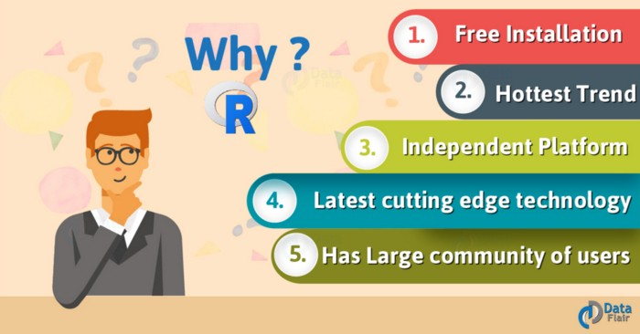
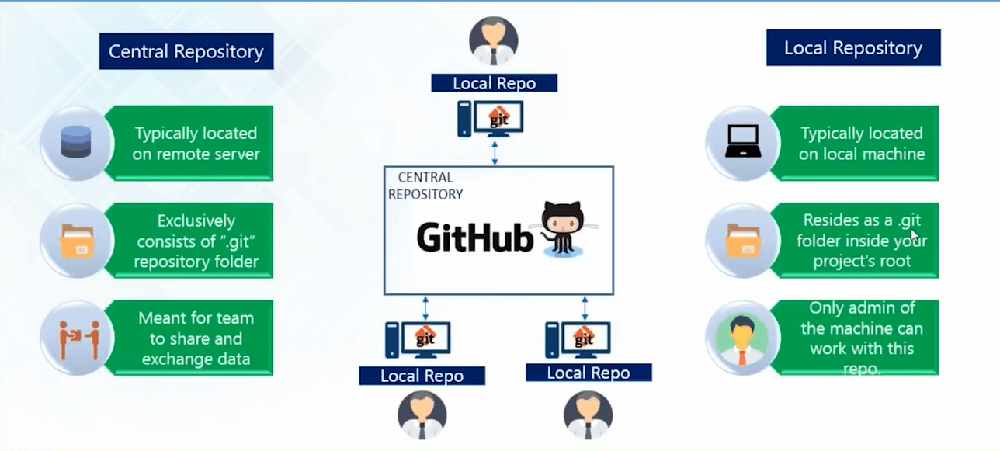
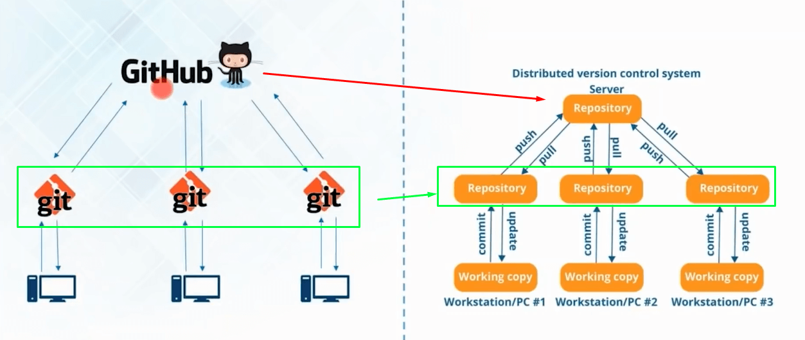
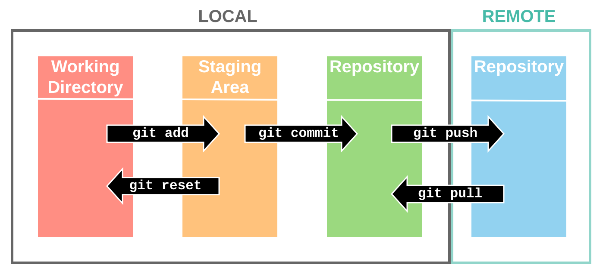
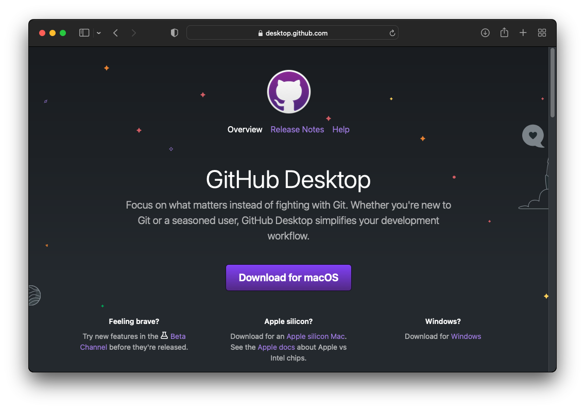
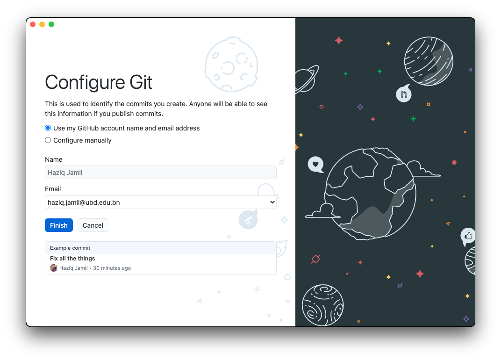

---
params:
  handout: 
title: "SM-2302 Software for Mathematicians"
subtitle: "R0 & Git: Getting started \\only<handout>{\\emph{[handout version]}}"
author: "Dr. Haziq Jamil"
date: "Semester I 2023/24"
institute: |
  | Mathematical Sciences, Faculty of Science, UBD
  | \url{https://haziqj.ml}
output: 
  beamer_presentation:
    template: ubd_beamer_rmd.tex
    latex_engine: xelatex
    slide_level: 3
    keep_tex: false
    citation_package: biblatex
    pandoc_args: ["--lua-filter=luafilters/mycustom.lua", "--lua-filter=luafilters/bookdown.lua"] 
header-includes:
  - \renewcommand{\Pr}{\operatorname{P}}
  - \usetikzlibrary{fit}
  - \usetikzlibrary{shapes.geometric}
# include-after:
#   -
aspectratio: 169
handout: "`r params$handout`"
toc: false
toctitle: Overview
tocmulticol:
transitions: true
progressdots: false
# banner: true
# logo: true
# bibliography: 
# bibstyle: 
refslide: false
thankyou: false
editor_options: 
  markdown: 
    wrap: 72
---

```{r setup, include = FALSE}
def.chunk.hook  <- knitr::knit_hooks$get("chunk")
knitr::knit_hooks$set(chunk = function(x, options) {
  x <- def.chunk.hook(x, options)
  ifelse(options$size != "normalsize", paste0("\n \\", options$size,"\n\n", x, "\n\n \\normalsize"), x)
})
# https://stackoverflow.com/questions/25646333/code-chunk-font-size-in-rmarkdown-with-knitr-and-latex

knitr::opts_chunk$set(
  echo = TRUE, 
  warning = FALSE,
  message = FALSE,
  error = TRUE,
  fig.height = 5, 
  fig.width = 5, 
  fig.path = "figure/", 
  fig.align = "center",
  cache = TRUE, 
  cache.path = "_cache/",
  size = "footnotesize"
)
options(width = 85)  # if 4:3 set to 55; if 16:9 set to 70
library(tidyverse)
theme_set(theme_classic())
library(tidyverse)
library(ggpubr)
library(cowplot)
library(ggrepel)
library(ggforce)

ubdblue <- "#325494"
ubdteal <- "#58DDB3"
ubdyellow <- "#F5C946"
ubdred <- "#B10F2E"
navyblue <- "#002f5c"
solidpink <- "#8E3B46"

mycol <- c("#30123BFF", "#4777EFFF", "#1BD0D5FF", "#62FC6BFF", "#D2E935FF",
           "#FE9B2DFF", "#DB3A07FF", "#7A0403FF")
```

# R

## Learning objectives

- Introduction to R, RStudio and learn the difference between the two
- Familiarisation with RStudio layout and customising appearance
- Using the help (`?`) function
- `base` package and installing other packages
- Setting up working directory and project area
- Using R script files vs working through the console
- Importing data

\vspace{1em}

Highly recommended book:

https://rstudio-education.github.io/hopr/index.html 

## Why learn R?

```{r, echo = FALSE, out.width = "80%", fig.align = "center"}

```

\blfootnote{\url{https://towardsdatascience.com/a-complete-guide-to-learn-r-29e691c61d1}}

## Get started


### Before we start


::: {.block}
#### Preamble
Before proceeding, some best practices on how to properly conduct data analysis:

1. Keep all files in one folder (working directory), including data file, `R` scripts, etc.
2. When working with large amounts of files, perhaps better to organise into sub-folders (e.g. folders for code, figures, data, etc.)
2. Use simple naming conventions for files and variables (no spaces, no caps, no special characters, etc.)
3. Create an RStudio project file so that the working directory, environment, code history, etc. is preserved
4. Collect all your `R` code into `R` scripts. Don't rely on the console.


:::


### Hello, World!

\Huge

```{r, eval = FALSE, size = "huge"}
my_string <- "Hello, World!"
print(my_string)
```

\vspace{3em}

```{r, echo = FALSE, size = "huge"}
my_string <- "Hello, World!"
print(my_string)
```

### Titanic data analysis

\huge

> Create an R Project containing the the files in the `R Demo` folder from Canvas. You may run the code line by line. 

Observe the way the code is written and formatted, as well as where comments are placed.

\vspace{1em}

https://style.tidyverse.org/ 

# Git and GitHub

## Version control

### Why version control?


::: {.columns}

::: {.column width=48%}
- Simple formal system for tracking changes to a project over time

- Time machine for your projects
    + Track blame and/or praise
    + Remove the fear of breaking things

- Learning curve can be a bit steep, but when you need it you *REALLY* need it

:::

::: {.column width=48%}

:::

:::


### Why Git?


::: {.columns}

::: {.column width=48%}
- Distributed
    + Work online or offline
    + Collaborate with large groups

- Popular and Successful
    + Active development
    + Shiny new tools and ecosystems
    + Fast

- Tracks any type of file

- Branching
    + Smarter merges

:::

::: {.column width=48%}
```{r echo=FALSE, out.width="75%"}
knitr::include_graphics("figure/distributed-vc-system.png")
```
:::

:::

### Veryifying git installation

Git should already be installed in the lab PCs.
Verify by launching the terminal and typing

```{bash eval=FALSE}
haziqj@Naqiyyah-MBP ~ % git --version
git version 2.32.1 (Apple Git-133)
```

On your own PCs, you can install git by following the directions in [Happy Git and GitHub for the useR](https://happygitwithr.com/install-git.html).


### Git sitrep

\footnotesize
\vspace{-1.5em}

``` r
usethis::git_sitrep()
## Git config (global)
## • Name: <unset>
## • Email: <unset>
## • Global (user-level) gitignore file: <unset>
## • Vaccinated: FALSE
## ℹ See `?git_vaccinate` to learn more
## ℹ Defaulting to 'https' Git protocol
## • Default Git protocol: 'https'
## • Default initial branch name: <unset>
## GitHub
## • Default GitHub host: 'https://github.com'
## • Personal access token for 'https://github.com': <unset>
## • To create a personal access token, call `create_github_token()`
## • To store a token for current and future use, call `gitcreds::gitcreds_set()`
## ℹ Read more in the 'Managing Git(Hub) Credentials' article:
##   https://usethis.r-lib.org/articles/articles/git-credentials.html
## Git repo for current project
## ℹ No active usethis project
```

### Git vs GitHub

```{r echo = FALSE}

```

### Git vs GitHub (cont.)

```{r echo = FALSE}

```

### Git in a nutshell

\vspace{-2em}

```{r echo = FALSE, out.width = "100%"}

```

\blfootnote{\url{https://support.nesi.org.nz/hc/en-gb/articles/360001508515-Git-Reference-Sheet}}

### Quick tutorial

Follow along

\vspace{2em}

https://docs.github.com/en/get-started/quickstart/hello-world 


### Install GitHub Desktop

```{r echo = FALSE, out.height = "92%"}

```


## Configure Git

```{r echo = FALSE, out.height = "92%"}

```


### Configure Git (cont.)

::: {.alertblock latex="{Remark}"}
Do this only if sitrep still shows wrong info.
:::


The following will tell Git who you are, and other common configuration tasks.

```r
usethis::use_git_config(
  user.name = "Haziq Jamil",
  user.email = "haziq.jamil@ubd.edu.bn"
  # push.default = "simple",
  # pull.rebase = FALSE
)
```

This can also be done via the terminal with,


```{bash eval=FALSE}
$ git config --global user.name "Haziq Jamil"
$ git config --global user.email "haziq.jamil@ubd.edu.bn"
$ git config --global push.default simple
```

## Workflow and best practices

### Typical GitHub workflow

I want to start a project that involves some code.

1. Go to GitHub.com and create a new repo.
  
   - Can initialise accordingly (.gitignore and/or README)
   
2. Clone to local repo

3. Add code inside

4. Commit and push

> Not really going to spend much time branching and creating pull requests

### Version control best practices

- Commit early, often, and with complete code.

- Write clear and concise commit summary messages.

- Test code before you commit.

- Use branches.

- Communicate with your team.


### Git and GitHub resources

- Git's [Pro Git](https://git-scm.com/book/en/v2) book, Chapters [Getting Started](https://git-scm.com/book/en/v2/Getting-Started-About-Version-Control) 
and [Git Basics](https://git-scm.com/book/en/v2/Git-Basics-Getting-a-Git-Repository) 
will be most useful if you are new to Git and GitHub

- [Git cheatsheet](https://www.atlassian.com/git/tutorials/atlassian-git-cheatsheet) 
by Atlassian

- GitHub's interactive [tutorial](https://try.github.io/)

- [Free online course](https://www.udacity.com/course/version-control-with-git--ud123) 
from Udacity

- [Happy Git with R](http://happygitwithr.com/) by Jenny Bryan


