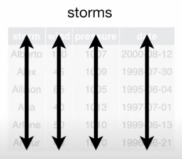
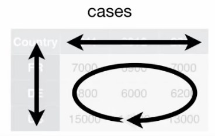
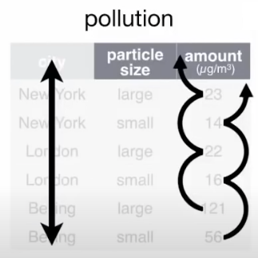
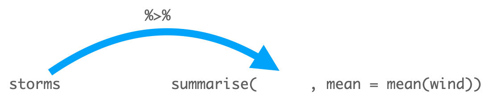
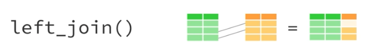

---
params:
  handout: 
title: "SM-2302 Software for Mathematicians"
subtitle: "R3: The `tidyverse` \\only<handout>{\\emph{[handout version]}}"
author: "Dr. Haziq Jamil"
date: "Semester I 2023/24"
institute: |
  | Mathematical Sciences, Faculty of Science, UBD
  | \url{https://haziqj.ml}
output: 
  beamer_presentation:
    template: ubd_beamer_rmd.tex
    latex_engine: xelatex
    slide_level: 3
    keep_tex: false
    citation_package: biblatex
    pandoc_args: ["--lua-filter=luafilters/mycustom.lua", "--lua-filter=luafilters/bookdown.lua"] 
header-includes:
  - \renewcommand{\Pr}{\operatorname{P}}
  - \usetikzlibrary{fit}
  - \usetikzlibrary{shapes.geometric}
# include-after:
#   -
aspectratio: 169
handout: "`r params$handout`"
toc: false
toctitle: Overview
tocmulticol:
transitions: true
progressdots: false
# banner: true
# logo: true
# bibliography: 
# bibstyle: 
refslide: false
thankyou: false
editor_options: 
  markdown: 
    wrap: 72
---

```{r setup, include = FALSE}
def.chunk.hook  <- knitr::knit_hooks$get("chunk")
knitr::knit_hooks$set(chunk = function(x, options) {
  x <- def.chunk.hook(x, options)
  ifelse(options$size != "normalsize", paste0("\n \\", options$size,"\n\n", x, "\n\n \\normalsize"), x)
})
# https://stackoverflow.com/questions/25646333/code-chunk-font-size-in-rmarkdown-with-knitr-and-latex

knitr::opts_chunk$set(
  echo = TRUE, 
  warning = FALSE,
  message = FALSE,
  error = TRUE,
  fig.height = 5, 
  fig.width = 5, 
  fig.path = "figure/", 
  fig.align = "center",
  cache = TRUE, 
  cache.path = "_cache/",
  size = "footnotesize"
)
options(width = 85)  # if 4:3 set to 55; if 16:9 set to 70
library(tidyverse)
theme_set(theme_classic())
library(tidyverse)
library(ggpubr)
library(cowplot)
library(ggrepel)
library(ggforce)
library(EDAWR)

ubdblue <- "#325494"
ubdteal <- "#58DDB3"
ubdyellow <- "#F5C946"
ubdred <- "#B10F2E"
navyblue <- "#002f5c"
solidpink <- "#8E3B46"

mycol <- c("#30123BFF", "#4777EFFF", "#1BD0D5FF", "#62FC6BFF", "#D2E935FF",
           "#FE9B2DFF", "#DB3A07FF", "#7A0403FF")
```


### Preamble

\vspace{-1em}

```{r, eval = FALSE}
# If not installed yet, install them first
library(tidyverse)
library(remotes)

# This may require compilation
remotes::install_github("rstudio/EDAWR")
library(EDAWR)  # to get the data sets: storms, cases, pollution, tb
```

\small

Note that installing `{EDAWR}` package may require compilation.
For Windows, check out [Rtools42](https://cran.r-project.org/bin/windows/Rtools/rtools42/rtools.html). 
For Macs, I think minimally you will need to install Xcode.
Check out this [link](https://mac.r-project.org/tools/).


\vspace{1em}

These slides were adapted from the following YouTube playlist. 

- [Data wrangling with R and the Tidyverse](https://www.youtube.com/playlist?list=PL9HYL-VRX0oQOWAFoKHFQAsWAI3ImbNPk) by Garrett Grolemund, RStudio.

I would recommend that you watch them, but note that the video is based on the old version of `tidyverse` packages, so some commands may be deprecated or superseded.

### Learning objectives

- Spot the **variables** and **observations** within your data
  
  - Variables = Columns 
  - Observations = Rows
  
- **Reshape** your data into the layout that works best for R 

  - Long vs wide data sets
  - Long $\rightarrow$ wide using `pivot_wider()` 
  - Wide $\rightarrow$ long using `pivot_longer()`
  
- *Quickly* \underline{derive new} variables and observations to explore

  - `mutate()` or `summarise()` to add new variables or summarise data
  - `select()`, `filter()`, `slice()`, `arrange()` to focus and/or reveal information

- Perform **group-wise** summaries to explore hidden levels of information within your data 
 
  - `group_by()`

- Join multiple data sets together

  - `bind_cols()`, `bind_rows()`, `left_join()` and other `*_join()`

### The `tidyverse` package

::: {.columns}

:::: {.column width=48%}
The [`tidyverse`](https://www.tidyverse.org/packages/) is a collection of R packages designed for data science.
Today we're most interested in the following packages:

\vspace{1em}

1. `tibble`

    A modern re-imagining of `data.frame`s.

2. `tidyr`

    Provides a set of functions that help you get to tidy data.

3. `dplyr`

    Provides a set of verbs for data manipulation.

::::

:::: {.column width=48%}
\vspace{-1em}
```{r, echo = FALSE, out.width = "85%"}

```
::::

:::

### Tibbles: Modern data frames

\vspace{-1em}

```{r echo=1}
library(tibble)
options(width=50)
```

\vspace{-2em}

:::: {.columns}

::: {.column width=49%}
```{r, echo}
iris
```
:::

::: {.column width=49%}
```{r, echo = 1}
(tbl_iris <- as_tibble(iris))
```
:::

::::

### Tibbles: Modern data frames (cont.)

Some features of `tibbles`:

1. An ehanced `print()` method, making it easier to use with large data sets containing complex objects.

2. They are lazy

   - Subsetting results in another `tibble` (does not `drop` dimensions).
   - Partial matching does not work--you need to type the full variable name.
   - `stringsAsFactors = FALSE` by default (for character data).
   - Only vectors of length 1 will undergo length coercion.
  
3. They are surly (complains more!)
  - Forces you to confront problems earlier, leading to cleaner and more expressive code.

Additional reading: https://r4ds.had.co.nz/tibbles.html 

### TL;DR--Use the cheat sheet!

Have a look at the Data Wrangling [cheat sheet](https://www.rstudio.com/wp-content/uploads/2015/02/data-wrangling-cheatsheet.pdf) from RStudio.

```{r, echo = FALSE, out.height = "80%"}
knitr::include_graphics("figure/data-wrangling-cheatsheet.pdf")
```


# Tidy data

Data comes in various shapes and formats.
It's important when you begin your analysis to identify this at the outset.

- What are the variables? How many of them are there?
- What are the observations? How many of them are there?

The goal is to reshape your data into a format that works best in R.
The resulting format is called **tidy data**.

\vspace{1em}

Let's have a look at three data sets:

1. `storms` (Wind speed data for six hurricanes)
2. `cases` (Data from the WHO Global Tuberculosis report)
3. `pollution` (Ambient air polution from WHO)

### 1. `storms` data set


::: {.columns}

:::: {.column width=55%}

\vspace{-1em}

```{r}
EDAWR::storms
```

- Variables: `storm`, `wind`, `pressure`, `date`
- Observations: 1, 2, 3, 4, 5, 6
- Notice that
   - Each variable is represented by \underline{a single} column
   - Each row is \underline{a single} observation

::::

:::: {.column width=43%}

\vspace{-2em}

```{r, echo = FALSE, out.width = "70%"}

```

Extracting data by subsetting easily:

- `storms$storm`
- `storms$wind`
- `storms$pressure`
- `storms$date`

::::

:::

### 2. `cases` data set

\framesubtitle{Wide format}

\vspace{-2em}

::: {.columns}

:::: {.column width=48%}

```{r}
EDAWR::cases
```

- Variables: `country`, `year = c(2011, 2012, 2013)`, `count`
- Observations: $3 \times 3 = 9$
- Notice that
   - Each cell of this data frame corresponds to the `count` for a given `country` and `year` 
   - Different from the `storms` data set!

::::

:::: {.column width=48%}

```{r, echo = FALSE, out.width = "70%"}

```

Extracting data by subsetting (not so easy):

- `cases$country`
- `colnames(cases)[-1]`
- `unlist(cases[1:3, 2:4]`

::::

:::

### 3. `pollution` data set

\framesubtitle{Long format}

::: {.columns}

:::: {.column width=48%}

\vspace{-1.5em}

```{r}
EDAWR::pollution
```

- Variables: `city`, `amount`
- Observations: 1, 2, 3, 4, 5, 6
- Notice that `amount` for each city is segregated into two groups: `large` and `small`.

::::

:::: {.column width=48%}

\vspace{-4em}

```{r, echo = FALSE, out.width = "70%"}

```

Extracting data by subsetting (hard):

- `pollution$city[c(1, 3, 5)]`
- `pollution$amount[c(1, 3, 5)]`
- `pollution$amount[c(2, 4, 6)]`

::::

:::

### Tidy data

The defining characteristics of tidy data are:
\vspace{1em}

> Variables in columns, observations in rows, and each type in a table.

This makes variables \underline{easy to access} and manipulate (while preserving observations).

```{r echo = FALSE, out.width = "30%", fig.show = "hold"}
knitr::include_graphics(c("figure/tidy1.png",
                          "figure/tidy2.png",
                          "figure/tidy3.png"))
```


# Getting tidy data (reshaping)

There are two main functions that we will use to reshape the layout of tables:

1. `pivot_wider()`
2. `pivot_longer()`

To a lesser degree, these utility functions may be useful too:

1. `separate()`
2. `unite()`
3. `arrange()`
4. `rename()`

## `pivot_longer()`

This converts data from wide format to long format.
In the `cases` data set, ideally we want to have three columns only: `country`, `year`, and `count`; and each row will be an observation.

```{r echo = FALSE, out.width = "80%"}
knitr::include_graphics("figure/pivot_longer.pdf")
```

### `pivot_longer()` (cont.)

\vspace{-1em}

::: {.columns}

:::: {.column width=43%}

```{r}
cases
```

<!-- `pivot_longer()` elongates a wide table, adding **two** columns: `names_to` and `values_to`. -->

\small

- Select which `cols` to pivot to longer format. Note that these have to be character vectors.

- `names_to` is the name of the new column to store the old columns

- `values_to` is the name of the new column to store the observations

::::

:::: {.column width=51%}

```{r}
pivot_longer(data = cases,
             cols = c("2011", "2012", "2013"),
             names_to = "year",
             values_to = "count")
```

::::

:::

## `pivot_wider()`

This converts data from long format to wide format.
In the `pollution` data set, we could instead have a table of city by particle size, and each cell is the amount.

```{r echo = FALSE, out.width = "80%"}
knitr::include_graphics("figure/pivot_wider.pdf")
```

### `pivot_wider()` (cont.)

\vspace{-1em}

::: {.columns}

:::: {.column width=58%}

```{r}
pollution
```

<!-- `pivot_longer()` elongates a wide table, adding **two** columns: `names_to` and `values_to`. -->

\small

- Select which `id_cols` uniquely identifies each observation

- `names_from` is the name of the column to spread 

- `values_from` is the name of column containing the observations

::::

:::: {.column width=40%}

```{r}
pivot_wider(data = pollution,
            id_cols = "city",
            names_from = "size",
            values_from = "amount")
```

::::

:::

## `separate()`

Turns a single character column into multiple columns.

::: {.columns}

:::: {.column width=46%}

```{r}
storms
```

::::

:::: {.column width=50%}

```{r}
separate(data = storms, 
         col = "date", 
         into = c("year", "month", "day"), 
         sep = "-") 
```

::::

:::

## `unite()`

Paste together multiple columns into one.

::: {.columns}

:::: {.column width=46%}

```{r, echo = -1}
storms2 <-
  separate(data = storms, 
           col = "date", 
           into = c("year", "month", "day"), 
           sep = "-") 
storms2
```

::::

:::: {.column width=50%}

```{r}
unite(data = storms2, 
      col = "date", 
      "year", "month", "day",
      sep = "-")
```

::::

:::

## `arrange()` 

Sorting rows (in ascending order) in a particular column is done using `arrange()`.


::: {.columns}

:::: {.column width=48%}

```{r}
# Before
storms
```

::::

:::: {.column width=48%}

```{r}
# After
arrange(.data = storms, wind)
```

::::

:::


### `arrange()` (cont.)

Sorting rows (in descending order) in a particular column is done by applying `desc()` on the variable.


::: {.columns}

:::: {.column width=48%}

```{r}
# Before
storms
```

::::

:::: {.column width=48%}

```{r}
# After
arrange(.data = storms, desc(wind))
```

::::

:::


### `arrange()` (cont.)

You may arrange by multiple columns in order.


::: {.columns}

:::: {.column width=48%}

```{r}
# Before
storms
```

::::

:::: {.column width=48%}

```{r}
# After
arrange(.data = storms, wind, date)
```

::::

:::

## `rename()`

A utility function to rename the columns.


::: {.columns}

:::: {.column width=48%}

```{r}
# Before
storms
```

::::

:::: {.column width=48%}

```{r}
# After
rename(.data = storms, 
       WIND = wind,
       Storm = storm)
```

::::

:::

# Data wrangling

Having obtained a tidy dataset, there are several ways to \underline{access} information.

1. **Extract** existing variables (columns).

   - `select()`
   
2. **Extract** existing observations (rows).

   - `filter()` or `slice()`

3. **Derive** new variables (from existing variables).

   - `mutate()`

4. **Change** the unit of analysis.

   - `summarise()`

Notice that these functions are *verbs* (action words). 
There are many more, of course.
Read more: https://dplyr.tidyverse.org/articles/programming.html 

## `select()`

Select variables in a data frame.

\vspace{-1em}

::: {.columns}

:::: {.column width=48%}

```{r}
# Before
storms
```

::::

:::: {.column width=48%}

```{r}
# After
select(.data = storms, storm, pressure)
```

::::

:::

\vspace{1em}

::: {.block}
#### Remark
You do not need to use quotes when choosing the variable names! I.e. `select(storms, "storm", "pressure")` is not necessary.
:::

### `select()`: Optionally rename

Optionally rename while selecting.

::: {.columns}

:::: {.column width=48%}

```{r}
# Before
storms
```

::::

:::: {.column width=48%}

```{r}
# After
select(.data = storms, STORM = storm, 
       PRESSURE = pressure)
```

::::

:::

### `select()`: Negative subsetting

Deselecting variables.

::: {.columns}

:::: {.column width=48%}

```{r}
# Before
storms
```

::::

:::: {.column width=48%}

```{r}
# After
select(.data = storms, -storm)
```

::::

:::

### `select()`: Selecting a range of consecutive variables

Use `:` to select a range of consecutive variables

::: {.columns}

:::: {.column width=48%}

```{r}
# Before
storms
```

::::

:::: {.column width=48%}

```{r}
# After
select(.data = storms, storm:pressure)
```

::::

:::


### Useful select functions

| Call            | Use                                                             |
|:---------------:|-----------------------------------------------------------------|
| `-`             | Select everything but                                           |
| `:`             | Select range                                                    |
| `contains()`    | Select columns whose name contains a character string           |
| `starts_with()` | Select column whose name starts with a character string         |
| `ends_with()`   | Select columns whose nmame ends with a string                   |
| `everything()`  | Select all columns                                              |
| `matches()`     | Select columns whose name matches a regular expression          |
| `num_range()`   | Select columns matching a numerical range e.g. `x1`, `x2`, etc. |
| `one_of()`      | Select columns whose names are in a group of names              |

There are others. 
See `?select` for further details.

## `filter()`

This is used to \underline{subset} a data frame, retaining all rows that satisfy your logical tests.

::: {.columns}

:::: {.column width=48%}

```{r}
# Before
storms
```

::::

:::: {.column width=48%}

```{r}
# After
filter(.data = storms, wind >= 50)
```

::::

:::

### `filter()` (cont.)

You can combine tests separated by commas.

::: {.columns}

:::: {.column width=48%}

```{r}
# Before
storms
```

::::

:::: {.column width=48%}

```{r}
# After
filter(.data = storms, 
       wind >= 50, 
       storm %in% c("Alberto", "Alex", 
                    "Allison"))
```

::::

:::

### Logical tests in R

::: {.columns}

:::: {.column width=48%}

`?Comparison`

| Test      | Usage                    |
|-----------|--------------------------|
| `<`       | Less than                |
| `>`       | Greater than             |
| `==`      | Equal to                 |
| `<=`      | Less than or equal to    |
| `>=`      | Greater than or equal to |
| `!=`      | Not equal to             |
| `%in%`    | Group membership         |
| `is.na()` | Is NA?                   |

::::

:::: {.column width=48%}

`?base::Logic`

| Operator  | Usage            |
|-----------|------------------|
| `&`       | Boolean and      |
| `\|`      | Boolean or       |
| `xor`     | Exactly or       |
| `!`       | Not              |
| `any()`   | Any true         |
| `all()`   | All true         |

::::

:::


## `slice()`

This lets you index rows by their (integer) locations.
Thus, it allows you to select, remove, and duplicate rows.

::: {.columns}

:::: {.column width=48%}

```{r}
# Before
storms
```

::::

:::: {.column width=48%}

```{r}
# After
slice(.data = storms, 1:3)
slice(.data = storms, rep(1, 3))
```

::::

:::

### `slice()` (cont.)

Using `which.min()` or `which.max()` (or other functions which return row indices) is quite helpful with `slice()`.

::: {.columns}

:::: {.column width=48%}

```{r}
# Before
storms
```

::::

:::: {.column width=48%}

```{r}
# After
slice(.data = storms, which.min(pressure))
slice(.data = storms, which.max(wind))
```

::::

:::


## `mutate()`

We may want to **create** new variables from existing variables.
Suppose we want to derive a new variable called `ratio` which is defined as 

$$
\texttt{ratio} = \frac{\texttt{pressure}}{\texttt{wind}}
$$

```{r echo = FALSE, out.width = "90%"}
knitr::include_graphics("figure/mutate.pdf")
```

### `mutate()` (cont.)

Using `dplyr`'s `mutate()` function, we are able to do this easily without having to use `$` all the time.


::: {.columns}

:::: {.column width=43%}

```{r}
# Before
storms
```

::::

:::: {.column width=53%}

```{r}
# After
mutate(.data = storms, 
       ratio = pressure / wind)
```

::::

:::

### `mutate()` (cont.)

Keep on adding new columns in the same `mutate()` call. 
Just separate them by commas.


```{r, echo = -1}
options(width = 80)
mutate(.data = storms, 
       ratio = pressure / wind,
       inverse = ratio ^ (-1))
```

### Useful `mutate()` functions

\vspace{-0.3em}

| Operator                | Usage                                              |
|-------------------------|----------------------------------------------------|
| `pmin()`, `pmax()`      | Element-wise min and max                           |
| `cummin()`, `cummax()`  | Cumulative min and max                             |
| `cumsum()`, `cumprod()` | Cumulative sum and product                         |
| `between()`             | Are values between `a` and `b`?                    |
| `cumall()`, `cumany()`  | Cumulative `all()` and `any()`                     |
| `cummean()`             | Cumulative mean                                    |
| `lead()`, `lag()`       | Comparing values behind or ahead of current values |
| `ntile()`               | Bin vector into `n` buckets                        |
| `row_number()`          | Returns row number                                 |

\vspace{-0.5em}

::: {.block}
#### Remark

All of these (window) functions take vector values and return \underline{vector values} of the same length.
If using non-window functions, the recycling rule applies.

:::

## `summarise()`

On the other hand, we may want to **condense** the available information.
For this, the `summarise()` function returns a \underline{new} data frame.


::: {.columns}

:::: {.column width=48%}

```{r}
# Before
pollution
```

::::

:::: {.column width=48%}

```{r}
# After
summarise(.data = pollution,
          median = median(amount),
          variance = var(amount))
```

::::

:::

### Useful `summarise()` functions

| Operator            | Usage                                       |
|---------------------|---------------------------------------------|
| `min()`, `max()`    | Minimum and maximum values                  |
| `mean()`            | Mean value                                  |
| `median()`          | Median value                                |
| `sum()`             | Sum of values                               |
| `var()`, `sd()`     | Variance and standard deviation of a vector |
| `first()`, `last()` | First or last value in a vector             |
| `nth()`             | Nth value in a vector                       |
| `n()`               | The number of values in a vector            |
| `n_distinct()`      | The number of distinct values in a vector   |

::: {.block}
#### Remark

All of these functions take vector values and return \underline{a single value}.

:::

### Summary (`summarise`) vs window (`mutate`) functions

```{r echo = FALSE, out.width = "100%", fig.show = "hold"}
knitr::include_graphics(c("figure/agg.pdf", "figure/window.pdf"))
```

- Functions used with `summarise()` should reduce the length of the input vector to a single value.

- Functions used with `mutate()` should keep the vector length.


# Pipeline

Consider the following sequence of actions that describe the process of getting to UBD campus everyday:

> I need to find my key, then unlock my car, then start my car, then drive to school, then park.

Expressed as a set of nested functions in R pseudocode this would look like:

```{r eval=FALSE}
park(drive(start_car(find("keys")), to = "campus"))
```


Writing it out using pipes give it a more natural (and easier to read) structure:

```{r eval=FALSE}
find("keys") %>%
    start_car() %>%
    drive(to = "campus") %>%
    park()
```

### The pipe operator `%>%`

The pipe operator puts the output of the LHS into the \underline{first} argument of the function of the RHS. 
\vspace{-1.5em}
```{r, out.width = "75%", echo = FALSE}

```

Therefore, the following code both do the same thing.

\vspace{-1.5em}

:::: {.columns}

::: {.column width=49%}
```{r}
summarise(storms, mean = mean(wind))
```
:::

::: {.column width=49%}
```{r}
storms %>% summarise(., mean = mean(wind))
```
:::

::::

\vspace{0.5em}

In fact, we may drop the '`.`' when the situation is obvious, i.e. `storms %>% summarise(mean = mean(wind))` would give the same thing.

### Combining `dplyr` functions 

For data wrangling, it seems more natural to progressively write code in a pipeline path.
As an example, consider the `nycflights13::flights` data set.
How many flights to LAX did each of the legacy carriers (AA, UA, DL or US) have in May from JFK, and what was their average duration?

```{r}
library(nycflights13)
filtered_flights <-   
  filter(.data = flights, 
         origin == "JFK", dest == "LAX", month == 5,
         carrier %in% c("AA", "UA", "DL", "US")) 
res <- summarise(.data = filtered_flights,
                 n = n(), avg_dur = mean(air_time, na.rm = TRUE))
res
```

### Combining `dplyr` functions (cont.)

In contrast, we can pipe the entire thing:

```{r}
flights %>%
  # Filter first
  filter(origin == "JFK", dest == "LAX", month == 5,
         carrier %in% c("AA", "UA", "DL", "US")) %>%
  # Then summarise
  summarise(
    n = n(),
    avg_dur = mean(air_time, na.rm = TRUE)
  )
```


### Another example

```{r}
flights %>%
  # Select all variables containing "delay" in their name
  select(contains("delay")) %>%
  # Create a new gain variable
  mutate(gain = arr_delay - dep_delay) %>%
  # Drop all rows with NA in them
  drop_na() %>%
  # Summarise
  summarise(
    min = min(gain),
    max = max(gain),
    mean = mean(gain)
  )
```

# Group wrangling

When we used the `summarise()` function, we were in fact using the **entire data set** to arrive at the summaries.

```{r, echo = FALSE, out.width = "100%"}
knitr::include_graphics("figure/group_by1.pdf")
```

e.g. `pollution %>% summarise(sum = sum(amount), n = n(), mean = mean(amount))`.


### Group wrangling (cont.)

Grouping the observations by some categorical variable allows us to uncover hidden information lying within the groups.
We use `group_by()` to do this.

```{r, echo = FALSE, out.width = "100%"}
knitr::include_graphics("figure/group_by2.pdf")
```

### Group wrangling (cont.)

The code to obtain the previous grouped summary table is

```{r}
pollution %>%
  group_by(city) %>%
  summarise(
    sum = sum(amount), 
    n = n(), 
    mean = mean(amount)
  )
```

### `ungroup()`

Note that when you group data, this will persist throughout the pipeline.
This is indicated by the `Groups: city [3]` print out below.
If, further down the pipeline, you wish to mutate or summarise based on the entire data set, you must first `ungroup()`.

::: {.columns}

:::: {.column width=48%}

```{r}
pollution %>%
  group_by(city)
```

::::

:::: {.column width=48%}

```{r}
pollution %>%
  group_by(city) %>%
  ungroup()
```

::::

:::

### Multiple groups

Multiple groupings are allowed.
Let's find the top 3 routes with the smallest departure delay in the `flights` dataset.

```{r, message = FALSE}
flights %>%
  group_by(origin, dest) %>%
  summarise(min_delay = min(dep_delay)) %>%
  arrange(min_delay) %>% 
  print(n = 3)
```


# Joining data sets

Here are the functions useful for combining data sets

1. `bind_cols()`
2. `bind_rows()`
3. `*_join()` commands
4. Other set operation functions such as `union()`, `intersect()`, and `setdiff()`

For more details on these functions, please have a look at https://github.com/gadenbuie/tidyexplain -- This page contains a helpful information about what the join functions do.

## `bind_cols()`

If you have two or more data frames (or columns) that are \underline{meant} to go together column-wise, then use `bind_cols()`.

```{r}
x <- select(storms, 1:3)  # First 3 columns of storms
y <- select(storms, date)  # The last column of storms
bind_cols(x, y)
```


## `bind_rows()`

Similarly if you wanted to stack two or more data frameson top of each other, then use `bind_rows()`.

```{r}
x <- storms[1:3, ]  # First 3 rows of storms
y <- storms[4:6, ]  # Last 3 rows of storms
bind_rows(x, y)
```

### Remark

```{r echo = FALSE, out.width = "80%"}
knitr::include_graphics("figure/bind_.png")
```

::: {.alertblock latex="{Warning}"}
`bind_cols()` and `bind_rows()` have no way of checking whether or not the joining is consistent (e.g. is the row-ordering the same between both data frames in `bind_cols()`?)
:::

## `left_join()`

Out of all the `*_join()` functions, this is probably the most frequently used (at least for me anyway).
When calling `left_join(x, y)`, this 

- adds columns from `y` to `x`;
- matching rows based on the `by` keys;
- and **includes all rows in `x`** (but possibly not `y`).

```{r echo = FALSE, out.width = "80%"}

```

### `left_join()` (cont.)

An example of `left_join()` on the band members and instruments data sets.

\vspace{-1.5em}

::: {.columns}

:::: {.column width=48%}

```{r}
band_members
```

::::

:::: {.column width=48%}

```{r}
band_instruments
```

::::

:::

```{r}
band_members %>%
  left_join(., band_instruments, by = "name")
```
