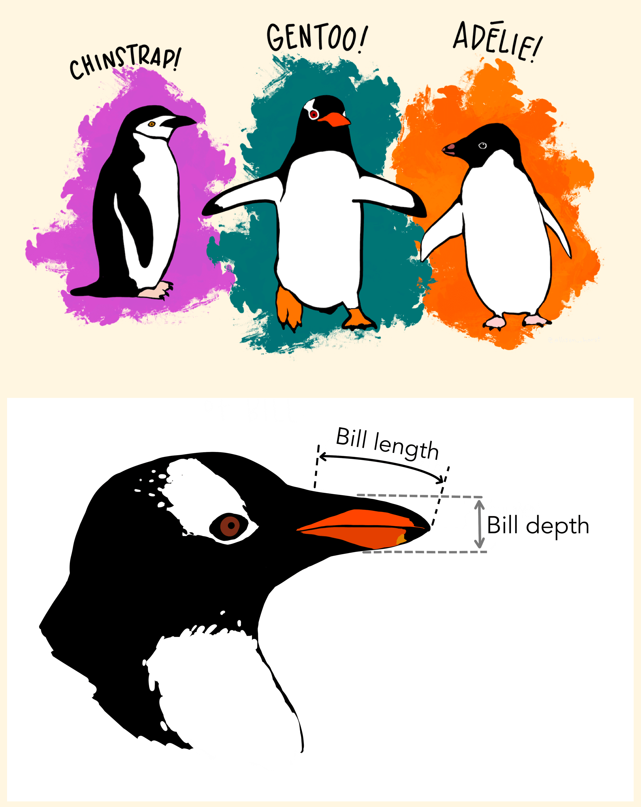

---
params:
  handout: 
title: "SM-2302 Software for Mathematicians"
subtitle: "R4: Plotting with `ggplot2` \\only<handout>{\\emph{[handout version]}}"
author: "Dr. Haziq Jamil"
date: "Semester I 2023/24"
institute: |
  | Mathematical Sciences, Faculty of Science, UBD
  | \url{https://haziqj.ml}
output: 
  beamer_presentation:
    template: ubd_beamer_rmd.tex
    latex_engine: xelatex
    slide_level: 3
    keep_tex: false
    citation_package: biblatex
    pandoc_args: ["--lua-filter=luafilters/mycustom.lua", "--lua-filter=luafilters/bookdown.lua"] 
header-includes:
  - \renewcommand{\Pr}{\operatorname{P}}
  - \usetikzlibrary{fit}
  - \usetikzlibrary{shapes.geometric}
# include-after:
#   -
aspectratio: 169
handout: "`r params$handout`"
toc: false
toctitle: Overview
tocmulticol:
transitions: true
progressdots: false
# banner: true
# logo: true
# bibliography: 
# bibstyle: 
refslide: false
thankyou: false
editor_options: 
  markdown: 
    wrap: 72
---

```{r setup, include = FALSE}
def.chunk.hook  <- knitr::knit_hooks$get("chunk")
knitr::knit_hooks$set(chunk = function(x, options) {
  x <- def.chunk.hook(x, options)
  ifelse(options$size != "normalsize", paste0("\n \\", options$size,"\n\n", x, "\n\n \\normalsize"), x)
})
# https://stackoverflow.com/questions/25646333/code-chunk-font-size-in-rmarkdown-with-knitr-and-latex

knitr::opts_chunk$set(
  echo = TRUE, 
  warning = FALSE,
  message = FALSE,
  error = TRUE,
  fig.height = 5, 
  fig.width = 5, 
  fig.path = "figure/", 
  fig.align = "center",
  cache = TRUE, 
  cache.path = "_cache/",
  size = "footnotesize"
)
options(width = 85)  # if 4:3 set to 55; if 16:9 set to 70
library(tidyverse)
theme_set(theme_bw())
library(tidyverse)
library(ggpubr)
library(cowplot)
library(ggrepel)
library(ggforce)

ubdblue <- "#325494"
ubdteal <- "#58DDB3"
ubdyellow <- "#F5C946"
ubdred <- "#B10F2E"
navyblue <- "#002f5c"
solidpink <- "#8E3B46"

mycol <- c("#30123BFF", "#4777EFFF", "#1BD0D5FF", "#62FC6BFF", "#D2E935FF",
           "#FE9B2DFF", "#DB3A07FF", "#7A0403FF")
```


# The Grammar of Graphics

- Visualization concept created by Leland Wilkinson (The Grammar of Graphics, 1999)--an attempt to taxonimize the basic elements of statistical graphics

- Adapted for R by Hadley Wickham (2009)
  - consistent and compact syntax to describe statistical graphics
  - highly modular as it breaks up graphs into semantic components 


- ggplot2 is not meant as a guide to which graph to use and how to best convey your data (more on that later), but it does have some strong opinions.


### Terminology

::: {.columns}


::: {.column width=40%}

A statistical graphic is a...

- mapping of **data**
- which may be **statistically transformed** (summarized, log-transformed, etc.)
- to **aesthetic attributes** (color, size, xy-position, etc.)
- using **geometric objects** (points, lines, bars, etc.)
- and mapped onto a specific **facet** and **coordinate system**

:::

::: {.column width=60%}

\vspace{-2em}

```{r echo = FALSE, fig.align = "center", out.width = "95%"}
knitr::include_graphics("figure/gglayers.png")
```

\footnotesize

http://r.qcbs.ca/workshop03/book-en/grammar-of-graphics-gg-basics.html
:::


:::


### Anatomy of a ggplot call

```{r, eval = FALSE}
ggplot(
     data = [dataframe], 
  mapping = aes(x = [var x], y = [var y], color = [var color], 
                shape = [var shape], ...)
) +
  geom_[some geom](
    mapping = aes(fill = [var geom color], ...),
    # other geometry options
  ) +
  ... # other geometries
  scale_[some axis]_[some scale]() +
  facet_[some facet]([formula]) +
  ... # other plot options 
      # usually labels, titles & themes
```

### Palmer Penguins

Measurements for penguin species, island in Palmer Archipelago, size (flipper length, body mass, bill dimensions), and sex.

:::: {.columns}

::: {.column width=32%}

\vspace{-1em}

```{r echo=FALSE, out.width="100%"}

```
:::

::: {.column width=66%}
\vspace{-1em}

```{r, echo = c(-1, -4)}
options(width = 55)
library(palmerpenguins)
penguins %>% print(n = 5)
options(width = 85)
```

:::

::::

### A basic ggplot

\vspace{-2em}

:::: {.columns}

::: {.column width=49%}
```{r echo=FALSE}
options(width = 55)
```
```{r penguins, fig.show = "hide"}
ggplot(data    = penguins, 
       mapping = aes(x = bill_depth_mm, 
                     y = bill_length_mm)) +
  geom_point() +
  labs(
    title = "Bill depth and length",
    subtitle = paste(
      "Dimensions for Adelie, Chinstrap,",
      "and Gentoo Penguins"
    ),
    x = "Bill depth (mm)", 
    y = "Bill length (mm)"
  )
```
```{r echo=FALSE}
options(width = 85)
```
:::

::: {.column width=49%}
```{r ref.label = "penguins", echo = FALSE, warning = FALSE}
```
:::

::::

# Breaking down the ggplot call

###

\footnotesize

**Start with the `penguins` data frame**

:::: {.columns}

::: {.column width=49%}
```{r penguins-0, fig.show = "hide", warning = FALSE}
ggplot(data = penguins)
```
:::

::: {.column width=49%}
```{r ref.label = "penguins-0", echo = FALSE, warning = FALSE}
```
:::

::::


###

\footnotesize

Start with the `penguins` data frame, **map bill depth to the x-axis**

:::: {.columns}

::: {.column width=49%}
```{r penguins-1, fig.show = "hide", warning = FALSE}
ggplot(
  data    = penguins,
  mapping = aes(x = bill_depth_mm) 
)
```
:::

::: {.column width=49%}
```{r ref.label = "penguins-1", echo = FALSE, warning = FALSE}
```
:::

::::

###

\footnotesize

Start with the `penguins` data frame, map bill depth to the x-axis, **and map bill length to the y-axis.**

:::: {.columns}

::: {.column width=49%}
```{r penguins-2, fig.show = "hide", warning = FALSE}
ggplot(
  data    = penguins,
  mapping = aes(x = bill_depth_mm,
                y = bill_length_mm) 
) 
```
:::

::: {.column width=49%}
```{r ref.label = "penguins-2", echo = FALSE, warning = FALSE}
```
:::

::::

###

\footnotesize

Start with the `penguins` data frame, map bill depth to the x-axis, and map bill length to the y-axis. **Represent each observation with a point**

:::: {.columns}

::: {.column width=49%}
```{r penguins-3, fig.show = "hide", warning = FALSE}
ggplot(
  data    = penguins,
  mapping = aes(x = bill_depth_mm,
                y = bill_length_mm) 
) +
  geom_point()
```
:::

::: {.column width=49%}
```{r ref.label = "penguins-3", echo = FALSE, warning = FALSE, fig.height = 4.7}
```
:::

::::


###

\footnotesize

Start with the `penguins` data frame, map bill depth to the x-axis, and map bill length to the y-axis. Represent each observation with a point **and map species to the colour of each point.**

:::: {.columns}

::: {.column width=49%}
```{r penguins-4, fig.show = "hide", warning = FALSE}
ggplot(
  data    = penguins,
  mapping = aes(x = bill_depth_mm,
                y = bill_length_mm) 
) +
  geom_point(
    mapping = aes(colour = species)
  )
```
:::

::: {.column width=49%}
```{r ref.label = "penguins-4", echo = FALSE, warning = FALSE, fig.height = 4.7}
```
:::

::::

###

\footnotesize

Start with the `penguins` data frame, map bill depth to the x-axis, and map bill length to the y-axis. Represent each observation with a point and map species to the color of each point. **Title the plot "Bill depth and length"**

\vspace{-0.5em}

:::: {.columns}

::: {.column width=49%}
```{r penguins-5, fig.show = "hide", warning = FALSE}
ggplot(
  data    = penguins,
  mapping = aes(x = bill_depth_mm,
                y = bill_length_mm) 
) +
  geom_point(
    mapping = aes(colour = species)
  ) +
  labs(title = "Bill depth and length") 
```
:::

::: {.column width=49%}
```{r ref.label = "penguins-5", echo = FALSE, warning = FALSE, fig.height = 4.5}
```
:::

::::


###

\footnotesize

Start with the `penguins` data frame, map bill depth to the x-axis, and map bill length to the y-axis. Represent each observation with a point and map species to the color of each point. Title the plot "Bill depth and length" **and add the subtitle "Dimensions for Adelie, Chinstrap, and Gentoo Penguins"**

\vspace{-0.5em}

:::: {.columns}

::: {.column width=49%}
```{r penguins-6, fig.show = "hide", warning = FALSE}
ggplot(
  data    = penguins,
  mapping = aes(x = bill_depth_mm,
                y = bill_length_mm) 
) +
  geom_point(
    mapping = aes(colour = species)
  ) +
  labs(
    title    = "Bill depth and length",
    subtitle = paste("Dimensions for Adelie,",
                     "Chinstrap, and Gentoo", 
                     "Penguins")
  )
```
:::

::: {.column width=49%}
```{r ref.label = "penguins-6", echo = FALSE, warning = FALSE, fig.height = 4.5}
```
:::

::::

###

\footnotesize

Start with the `penguins` data frame, map bill depth to the x-axis, and map bill length to the y-axis. Represent each observation with a point and map species to the color of each point. Title the plot "Bill depth and length" **label the x and y axes as "Bill depth (mm)" and "Bill length (mm)", respectively**

\vspace{-0.5em}

:::: {.columns}

::: {.column width=49%}

```{r penguins-7, fig.show = "hide", warning = FALSE}
ggplot(
  data    = penguins,
  mapping = aes(x = bill_depth_mm,
                y = bill_length_mm) 
) +
  geom_point(
    mapping = aes(colour = species)
  ) +
  labs(
    title    = "Bill depth and length",
    subtitle = paste("Dimensions for Adelie,",
                     "Chinstrap, and Gentoo", 
                     "Penguins"),
    x        = "Bill depth (mm)",
    y        = "Bill length (mm)"
  )
```
:::

::: {.column width=49%}
```{r ref.label = "penguins-7", echo = FALSE, warning = FALSE, fig.height = 4.5}
```
:::

::::

###

\footnotesize

Start with the `penguins` data frame, map bill depth to the x-axis, and map bill length to the y-axis. Represent each observation with a point and map species to the color of each point. Title the plot "Bill depth and length" label the x and y axes as "Bill depth (mm)" and "Bill length (mm)", respectively. **Label the legend "Species"**

\vspace{-1em}

:::: {.columns}

::: {.column width=49%}

```{r penguins-8, fig.show = "hide", warning = FALSE}
ggplot(
  data    = penguins,
  mapping = aes(x = bill_depth_mm,
                y = bill_length_mm) 
) +
  geom_point(
    mapping = aes(colour = species)
  ) +
  labs(
    title    = "Bill depth and length",
    subtitle = paste("Dimensions for Adelie,",
                     "Chinstrap, and Gentoo", 
                     "Penguins"),
    x        = "Bill depth (mm)",
    y        = "Bill length (mm)",
    colour   = "Species"
  )
```
:::

::: {.column width=49%}

```{r ref.label = "penguins-8", echo = FALSE, warning = FALSE, fig.height = 4.6}
```
:::

::::


###

\footnotesize

Start with the `penguins` data frame, map bill depth to the x-axis, and map bill length to the y-axis. Represent each observation with a point and map species to the color of each point. Title the plot "Bill depth and length" label the x and y axes as "Bill depth (mm)" and "Bill length (mm)", respectively. Label the legend "Species" **and add caption.**


:::: {.columns}

::: {.column width=49%}

```{r penguins-9, fig.show = "hide", warning = FALSE}
ggplot(penguins, aes(x = bill_depth_mm,
                     y = bill_length_mm)) +
  geom_point(aes(colour = species)) +
  labs(
    title    = "Bill depth and length",
    subtitle = paste("Dimensions for Adelie,",
                     "Chinstrap, and Gentoo", 
                     "Penguins"),
    x        = "Bill depth (mm)", 
    y        = "Bill length (mm)",
    colour   = "Species",
    caption  = "Source: palmerpenguins package" 
  )
```
:::

::: {.column width=49%}

\vspace{-1.5em}

```{r ref.label = "penguins-9", echo = FALSE, warning = FALSE, fig.height = 4.7}
```
:::

::::

### Argument names

Often we omit the names of first two arguments when building plots with `ggplot()`.


:::: {.columns}

::: {.column width=49%}
```{r named-args, eval = FALSE}
ggplot(
  data = penguins,
  mapping = aes(x = bill_depth_mm,
                y = bill_length_mm)
) +
  geom_point(
    mapping = aes(color = species)
  )
```
:::

::: {.column width=49%}
```{r not-named-args, eval = FALSE}
ggplot(penguins, aes(x = bill_depth_mm,
                     y = bill_length_mm)) +
  geom_point(aes(col = species))
```
:::

::::

\vspace{1em}

Note that `ggplot` and `geom_*` swap the order of the `data` and `mapping` arguments.

# Aesthetics

### Aesthetics options

Commonly used characteristics of plotting geometries that can be **mapped to a specific variable** in the data, examples include:

- position (`x`, `y`)
- `color`
- `shape`
- `size`
- `alpha` (transparency)

Different geometries have different aesthetics that can be used - see the [ggplot2 geoms](https://ggplot2.tidyverse.org/reference/index.html#Geoms) help files for listings.


* Aesthetics given in `ggplot()` apply to all `geom`s.

* Aesthetics for a specific `geom_*()` can be overridden via the `mapping` argument.

### Colour

Mapping `species` to a unique colour.

\vspace{-0.5em}

:::: {.columns}

::: {.column width=49%}
```{r colour, fig.show = "hide", warning = FALSE}
ggplot(penguins, aes(x = bill_depth_mm, 
                     y = bill_length_mm)) + 
  geom_point(aes(col = species))
```
:::

::: {.column width=49%}
```{r ref.label = "colour", echo = FALSE, warning = FALSE, fig.height = 4.3}
```
:::

::::


### Shape

Mapping an additional variable (`island` to shape).

\vspace{-0.5em}

:::: {.columns}

::: {.column width=49%}

```{r shapeisland, fig.show = "hide", warning = FALSE}
ggplot(penguins, aes(x = bill_depth_mm, 
                     y = bill_length_mm)) + 
  geom_point(aes(col = species,
                 shape = island))
```
:::

::: {.column width=49%}
```{r ref.label = "shapeisland", echo = FALSE, warning = FALSE, fig.height = 4.3}
```
:::

::::


### Shape (cont.)

Mapped to same variable `species` to **both** shape and colour.

\vspace{-0.5em}

:::: {.columns}

::: {.column width=49%}

```{r shapespecies, fig.show = "hide", warning = FALSE}
ggplot(penguins, aes(x = bill_depth_mm, 
                     y = bill_length_mm)) + 
  geom_point(aes(col = species,
                 shape = species))
```
:::

::: {.column width=49%}
```{r ref.label = "shapespecies", echo = FALSE, warning = FALSE, fig.height = 4.3}
```
:::

::::

### Size

Control the size of the points. 
Note that this is a fixed value (outside of the `aes` call).

\vspace{-0.5em}

:::: {.columns}

::: {.column width=49%}

```{r size1, fig.show = "hide", warning = FALSE}
ggplot(penguins, aes(x = bill_depth_mm, 
                     y = bill_length_mm)) + 
  geom_point(aes(col = species,
                 shape = species),
             size = 3)
```
:::

::: {.column width=49%}
```{r ref.label = "size1", echo = FALSE, warning = FALSE, fig.height = 4.3}
```
:::

::::


### Size (cont.)

Mapping the size aesthetic to a variable.

\vspace{-0.5em}

:::: {.columns}

::: {.column width=49%}

```{r size2, fig.show = "hide", warning = FALSE}
ggplot(penguins, aes(x = bill_depth_mm, 
                     y = bill_length_mm)) + 
  geom_point(aes(col = species,
                 shape = species,
                 size = body_mass_g))
```
:::

::: {.column width=49%}
```{r ref.label = "size2", echo = FALSE, warning = FALSE, fig.height = 4.3}
```
:::

::::


### Alpha

Mapping the transparency aesthetic to a variable.

\vspace{-0.5em}

:::: {.columns}

::: {.column width=49%}

```{r alpha, fig.show = "hide", warning = FALSE}
ggplot(penguins, aes(x = bill_depth_mm, 
                     y = bill_length_mm)) + 
  geom_point(aes(col = species,
                 shape = species,
                 alpha = body_mass_g),
             size = 3)
```
:::

::: {.column width=49%}
```{r ref.label = "alpha", echo = FALSE, warning = FALSE, fig.height = 4.3}
```
:::

::::

### Mapping vs settings

- **Mapping:** Determine an aesthetic (the size, alpha, etc.) of a geom based on the values of a variable in the data
  - wrapped by `aes()` and pass as `mapping` argument to `ggplot()` or `geom_*()`.

- **Setting:** Determine an aesthetic (the size, alpha, etc.) of a geom **not** based on the values of a variable in the data, usually a constant value.
  - passed directly into `geom_*()` as an argument.


\vspace{1em}

From the previous slide `color`, `shape`, and `alpha` are all **aesthetics** while `size` is a **setting**.


# Faceting

- Smaller plots that display different subsets of the data

- Useful for exploring conditional relationships and large data

\vspace{-1em}

:::: {.columns}


::: {.column width=49%}
```{r, warning = FALSE, echo = FALSE, fig.height = 4.1}
ggplot(
  penguins, 
  aes(
    x = bill_depth_mm, 
    y = bill_length_mm
  )
) + 
  geom_point(
    aes(
      color = species,
      shape = island
    ), 
    size = 3
  )
```
:::

::: {.column width=49%}
```{r, warning = FALSE, echo = FALSE, fig.height = 4.1}
ggplot(
  penguins, 
  aes(
    x = bill_depth_mm, 
    y = bill_length_mm
  )
) + 
  geom_point() +
  facet_grid( species ~ island ) 
```
:::

::::

### `facet_grid()` columns

\vspace{-1em}

:::: {.columns}

::: {.column width=49%}
```{r facet2, warning = FALSE, fig.show = "hide"}
ggplot(penguins, aes(x = bill_depth_mm, 
                     y = bill_length_mm)
) + 
  geom_point() +
  facet_grid(. ~ species)
```
:::

::: {.column width=49%}
```{r ref.label = "facet2", echo = FALSE, warning = FALSE, out.width = "95%"}
```
:::

::::

### `facet_grid()` rows

\vspace{-1em}

:::: {.columns}

::: {.column width=49%}
```{r facet3, warning = FALSE, fig.show = "hide"}
ggplot(penguins, aes(x = bill_depth_mm, 
                     y = bill_length_mm)
) + 
  geom_point() +
  facet_grid(species ~ .)
```
:::

::: {.column width=49%}
```{r ref.label = "facet3", echo = FALSE, warning = FALSE, out.width = "95%"}
```
:::

::::


### `facet_grid()` both rows and columns

\vspace{-1em}

:::: {.columns}

::: {.column width=49%}
```{r facet4, warning = FALSE, fig.show = "hide"}
ggplot(penguins, aes(x = bill_depth_mm, 
                     y = bill_length_mm)
) + 
  geom_point() +
  facet_grid(species ~ island)
```
:::

::: {.column width=49%}
```{r ref.label = "facet4", echo = FALSE, warning = FALSE, out.width = "95%"}
```
:::

::::

### Faceting and color

\vspace{-1em}

:::: {.columns}

::: {.column width=49%}
```{r facet5, warning = FALSE, fig.show = "hide"}
ggplot(penguins, aes(x = bill_depth_mm, 
                     y = bill_length_mm)
) + 
  geom_point(aes(col = species)) +
  facet_grid(species ~ island) +
  # this removes the legend
  guides(col = "none")  
```
:::

::: {.column width=49%}
```{r ref.label = "facet5", echo = FALSE, warning = FALSE, out.width = "95%"}
```
:::

::::

### `facet_wrap()`

Instead of a matrix, `facet_wrap()` wraps a sequence of panels into 2 dimensions.


:::: {.columns}

::: {.column width=49%}
```{r facet6, warning = FALSE, fig.show = "hide", results = "hold"}
ggplot(penguins, aes(x = bill_depth_mm, 
                     y = bill_length_mm)
) + 
  geom_point() +
  facet_wrap(species ~ island) 
  # control number of rows and columns
  # by nrow = xxx and ncol = yyy
```
:::

::: {.column width=49%}
```{r ref.label = "facet6", echo = FALSE, warning = FALSE, out.width = "95%", fig.height = 4.6}
```
:::

::::

### Free scales

It's not really recommended, but it is possible to free the scales of the $x$ and $y$ axis.

:::: {.columns}

::: {.column width=49%}
```{r facet7, warning = FALSE, fig.show = "hide", results = "hold"}
ggplot(penguins, aes(x = bill_depth_mm, 
                     y = bill_length_mm)
) + 
  geom_point(aes(col = species)) +
  facet_wrap(species ~ island, scales = "free") +
  guides(col = "none")
```
:::

::: {.column width=49%}
```{r ref.label = "facet7", echo = FALSE, warning = FALSE, out.width = "95%", fig.height = 4.6}
```
:::

::::


# A brief plot Tour of ggplot2 plots

### Histograms

<!-- :::: {.columns} -->

<!-- ::: {.column width=49%} -->

<!-- ```{r hist1, fig.show = "hide", warning = FALSE} -->
<!-- ggplot(penguins, aes(x = body_mass_g)) + -->
<!--   geom_histogram(bins = 50) -->
<!--   # control bins or binwidth -->
<!-- ``` -->
<!-- ::: -->

<!-- ::: {.column width=49%} -->
<!-- ```{r ref.label = "hist1", echo = FALSE, warning = FALSE, fig.height = 4.5} -->
<!-- ``` -->
<!-- ::: -->

<!-- :::: -->

<!-- ### Histograms (adding aesthetics) -->


:::: {.columns}

::: {.column width=49%}

```{r hist2, fig.show = "hide", warning = FALSE}
ggplot(penguins, aes(x = body_mass_g)) +
  geom_histogram(aes(fill = species), 
                 bins = 50,
                 alpha = 0.8) +
  labs(fill = NULL) +
  theme(legend.position = "top")
  # more on themes later!
```
:::

::: {.column width=49%}
```{r ref.label = "hist2", echo = FALSE, warning = FALSE, fig.height = 4.5}
```
:::

::::

### Density plots 


<!-- :::: {.columns} -->

<!-- ::: {.column width=49%} -->

<!-- ```{r dens1, fig.show = "hide", warning = FALSE} -->
<!-- ggplot(penguins, aes(x = body_mass_g)) + -->
<!--   geom_density()  -->
<!-- ``` -->
<!-- ::: -->

<!-- ::: {.column width=49%} -->
<!-- ```{r ref.label = "dens1", echo = FALSE, warning = FALSE, fig.height = 4.5} -->
<!-- ``` -->
<!-- ::: -->

<!-- :::: -->


<!-- ### Density plots (adding aesthetics) -->


:::: {.columns}

::: {.column width=49%}

```{r dens2, fig.show = "hide", warning = FALSE}
ggplot(penguins, aes(x = body_mass_g)) +
  geom_density(aes(fill = species,
                   col = species),
               alpha = 0.5) +
  labs(fill = NULL, col = NULL) +
  theme(legend.position = "top")
```
:::

::: {.column width=49%}
```{r ref.label = "dens2", echo = FALSE, warning = FALSE, fig.height = 4.5}
```
:::

::::


### Ridge plots 

:::: {.columns}

::: {.column width=49%}

```{r ridge, fig.show = "hide", warning = FALSE}
ggplot(
  penguins, 
  aes(
    x = body_mass_g,
    y = paste0(species, " (", sex, ")"),
    fill = species
  )
) +
  ggridges::geom_density_ridges(alpha = 0.5) +
  labs(x = "Body mass (g)", 
       y = "Species (sex)") +
  guides(fill = "none")
```
:::

::: {.column width=49%}
```{r ref.label = "ridge", message = FALSE, echo = FALSE, warning = FALSE, fig.height = 4.5}
```
:::

::::


### Box plots 

\vspace{-2em}

:::: {.columns}

::: {.column width=49%}
```{r boxplot1, warning = FALSE, fig.height = 3.8}
ggplot(penguins, aes(x = species,
                     y = body_mass_g)) +
  geom_boxplot()
```
:::

::: {.column width=49%}
```{r boxplot2, warning = FALSE, fig.height = 3.8}
ggplot(penguins, aes(x = body_mass_g,
                     y = species)) +
  geom_boxplot()
```
:::

::::

### Bar plots

\vspace{-2em}

:::: {.columns}

::: {.column width=49%}

```{r barplot1, warning = FALSE, fig.height = 3.9}
ggplot(penguins, aes(x = species)) +
  geom_bar()

```
:::

::: {.column width=49%}
```{r barplot2, warning = FALSE, fig.height = 3.7}
ggplot(penguins, aes(x = species,
                     fill = island)) +
  geom_bar()
```
:::

::::

### Bar plots (cont.)

\vspace{-2em}

:::: {.columns}

::: {.column width=49%}

```{r barplot3, warning = FALSE, fig.height = 3.8}
ggplot(penguins, aes(x = species,
                     fill = island)) +
  geom_bar(position = "fill")
```
:::

::: {.column width=49%}
```{r barplot4, warning = FALSE, fig.height = 3.8}
ggplot(penguins, aes(x = species,
                     fill = sex)) +
  geom_bar(position = "dodge")
```
:::

::::

### Scatter plot with `geom_smooth()`


\vspace{-2em}

:::: {.columns}

::: {.column width=49%}

```{r scatter1, warning = FALSE, message = FALSE, fig.height = 3.5}
ggplot(penguins, aes(x = bill_depth_mm,
                     y = bill_length_mm)) +
  geom_point() +
  geom_smooth()
```
:::

::: {.column width=49%}
```{r scatter2, warning = FALSE, message = FALSE, fig.height = 3.3}
ggplot(penguins, aes(x = bill_depth_mm,
                     y = bill_length_mm,
                     col = species)) +
  geom_point() +
  geom_smooth()
```
:::

::::


### Scatter plot with `geom_smooth()` (cont.)


:::: {.columns}

::: {.column width=49%}

```{r scatter3, warning = FALSE, message = FALSE, fig.show = "hide"}
ggplot(penguins, aes(x = bill_depth_mm,
                     y = bill_length_mm,
                     col = species)) +
  geom_point() +
  geom_smooth(method = "lm",
              se = FALSE,
              fullrange = TRUE)
```
:::

::: {.column width=49%}
```{r ref.label = "scatter3", message = FALSE, echo = FALSE, warning = FALSE, fig.height = 4.5}
```
:::

::::

### Line plots

:::: {.columns}

::: {.column width=49%}
```{r line, fig.show = "hide", warning = FALSE}
penguins %>%
  count(species, year) %>%
  ggplot(
    aes(
      x = year, 
      y = n, 
      color = species,
      group = species
    )
  ) +
  geom_line()
```
:::

::: {.column width=49%}
```{r ref.label = "line", message = FALSE, echo = FALSE, warning = FALSE, fig.height = 4.5}
```
:::

::::


# Themes

### ggplot2 themes

\vspace{-1em}

```{r theme1}
g <- ggplot(penguins, aes(species, body_mass_g, fill = species)) + geom_boxplot()
```

\vspace{-2em}

:::: {.columns}

::: {.column width=49%}
```{r theme2, warning=FALSE, out.width = "50%", fig.align = "center", fig.height = 3.2}
g + theme_classic()
g + theme_dark()
```
:::

::: {.column width=49%}
```{r theme3, warning=FALSE, out.width = "50%", fig.align = "center", fig.height = 3.2}
g + theme_minimal()
g + theme_void()
```
:::

::::


### ggthemes

\vspace{-1em}

```{r, message = FALSE}
library(ggthemes)
```

\vspace{-2em}

:::: {.columns}

::: {.column width=49%}
```{r theme4, warning=FALSE, out.width = "50%", fig.align = "center", fig.height = 3.2}
g + theme_economist() + scale_fill_economist()
g + theme_excel() + scale_fill_excel()
```
:::

::: {.column width=49%}
```{r theme5, warning=FALSE, out.width = "50%", fig.align = "center", fig.height = 3.2}
g + theme_gdocs() + scale_fill_gdocs()
g + theme_wsj() + scale_fill_wsj()
```
:::

::::


### Color scales

ggplot2's default colour scheme is simply an equally spaced hue around the colour wheel.


:::: {.columns}

::: {.column width=49%}

```{r warning = FALSE, message = FALSE, fig.show = "hide"}
ngroup <- 5
tibble(
  group = factor(1:ngroup),
  count = sample(10, size = ngroup, 
                 replace = TRUE)
) %>%
  ggplot(aes(group, count, fill = group)) +
  geom_bar(stat = "identity") +
  theme_classic() -> p
p
```
:::

::: {.column width=49%}
```{r  message = FALSE, echo = FALSE, warning = FALSE, fig.height = 4.3}
p
```
:::

::::

### Manually changing colours

\vspace{-1em}

:::: {.columns}

::: {.column width=49%}

```{r manualcol, warning = FALSE, message = FALSE, fig.show = "hide"}
p +
  scale_fill_manual(
    values = c("red", "blue", "green", 
               "yellow", "grey")
  )
```
:::

::: {.column width=49%}
```{r ref.label = "manualcol", message = FALSE, echo = FALSE, warning = FALSE, fig.height = 4.3}
```
:::

::::


### Viridis colour scale

\vspace{-1em}


:::: {.columns}

::: {.column width=49%}

```{r viridiscol, warning = FALSE, message = FALSE, fig.show = "hide"}
p + 
  scale_fill_viridis_d()

  # Here the _d stands for discrete.
  # Other scales include
  # scale_fill_viridis_c() &
  # scale_fill_viridis_b()
```
:::

::: {.column width=49%}
```{r ref.label = "viridiscol", message = FALSE, echo = FALSE, warning = FALSE, fig.height = 4.3}
```
:::

::::

### Viridis colour scale (cont.)

\vspace{-1em}

:::: {.columns}

::: {.column width=49%}

```{r viridiscol2, warning = FALSE, message = FALSE, fig.show = "hide"}
tibble(
  x = rnorm(10000),
  y = rnorm(10000)
) %>%
  ggplot(aes(x, y)) +
  geom_hex() + 
  coord_fixed() +  # ensures fixed x/y scales
  scale_fill_viridis_c(option = "plasma") + 
  theme_bw()
```
:::

::: {.column width=49%}
```{r ref.label = "viridiscol2", message = FALSE, echo = FALSE, warning = FALSE, fig.height = 4.6}
```
:::

::::

## GIS data

R handles GIS data via `sf` (simple features) objects.

:::: {.columns}

::: {.column width=49%}

```{r bruneimap, warning = FALSE, message = FALSE, fig.show = "hide"}
library(sf)
library(bruneimap)
# remotes::install.packages(
#   "propertypricebn/bruneimap"
# )
 
ggplot(kpg_sf) +
  geom_sf(aes(fill = mukim)) +
  geom_sf(data = mkm_sf, col = "black", 
          lwd = 0.5, fill = NA) +
  theme(legend.position = "none") +
  scale_fill_viridis_d(option = "turbo")
```
:::

::: {.column width=49%}
```{r ref.label = "bruneimap", message = FALSE, echo = FALSE, warning = FALSE, fig.height = 4.6}
```
:::

::::


# Other useful things

### GGAlly's `ggpairs()`

:::: {.columns}

::: {.column width=49%}

```{r ggally, warning = FALSE, message = FALSE, fig.show = "hide"}
GGally::ggpairs(
  data = drop_na(penguins),  
  columns = c("bill_length_mm",
              "bill_depth_mm",
              "body_mass_g",
              "sex"),
  mapping = aes(col = species)
) + 
  theme_bw()
```
:::

::: {.column width=49%}
```{r ref.label = "ggally", message = FALSE, echo = FALSE, warning = FALSE, fig.height = 4.5}
```
:::

::::

### Label points


:::: {.columns}

::: {.column width=49%}

```{r labels, warning = FALSE, message = FALSE, fig.show = "hide"}
rownames_to_column(mtcars) %>%
  ggplot(aes(wt, mpg, label = rowname)) +
  geom_point(col = "red3") +
  geom_text()
```
:::

::: {.column width=49%}
```{r ref.label = "labels", message = FALSE, echo = FALSE, warning = FALSE, fig.height = 4.5}
```
:::

::::


### Label points with ggrepel

:::: {.columns}

::: {.column width=49%}

```{r repel, warning = FALSE, message = FALSE, fig.show = "hide"}
rownames_to_column(mtcars) %>%
  ggplot(aes(wt, mpg, label = rowname)) +
  geom_point(col = "red3") +
  ggrepel::geom_text_repel()
```
:::

::: {.column width=49%}
```{r ref.label = "repel", message = FALSE, echo = FALSE, warning = FALSE, fig.height = 4.5}
```
:::

::::

### Adjusting axis scales

:::: {.columns}

::: {.column width=49%}

```{r axisscales, warning = FALSE, message = FALSE, fig.show = "hide"}
tibble(
  x = rnorm(1000),
  y = rnorm(1000)
) %>%
  ggplot(aes(x, y)) +
  geom_point() +
  scale_x_continuous(
    limits = c(-5, 5), 
    breaks = seq(-5, 5, by = 0.5)
  ) +
  scale_y_continuous(
    limits = c(-10, 10),
    name = "Hello"
  )
```
:::

::: {.column width=49%}
```{r ref.label = "axisscales", message = FALSE, echo = FALSE, warning = FALSE, fig.height = 4.5}
```
:::

::::

### Plot composition


\vspace{-1em}

```{r, message = FALSE}
library(patchwork)
```

\vspace{-2em}

:::: {.columns}

::: {.column width=49%}
```{r patchwork1, warning=FALSE, out.width = "50%", fig.align = "center", fig.height = 3}
(p1 <- ggplot(penguins) + 
  geom_boxplot(aes(island, body_mass_g)))
(p2 <- ggplot(penguins) + 
  geom_boxplot(aes(species, body_mass_g)))
```
:::

::: {.column width=49%}
```{r patchwork2, warning=FALSE, out.width = "50%", fig.align = "center", fig.height = 3}
(p3 <- ggplot(penguins) + 
  geom_point(aes(flipper_length_mm, 
                 body_mass_g, color = sex)))

(p4 <- ggplot(penguins) + 
  geom_point(aes(bill_length_mm, 
                 body_mass_g, color = sex)))
```
:::

::::

### Plot composition (cont.)

```{r, warning = FALSE, message = FALSE, out.width = "100%", fig.align = "center", fig.width = 9, fig.height = 3.8}
p1 + p2 + p3 + p4 + plot_layout(nrow = 2)
```


### Plot composition (cont.)

\vspace{-0.5em}

```{r, warning = FALSE, message = FALSE, out.width = "100%", fig.align = "center", fig.width = 9, fig.height = 3.8}
p1 / (p2 + p3 + p4)
```


