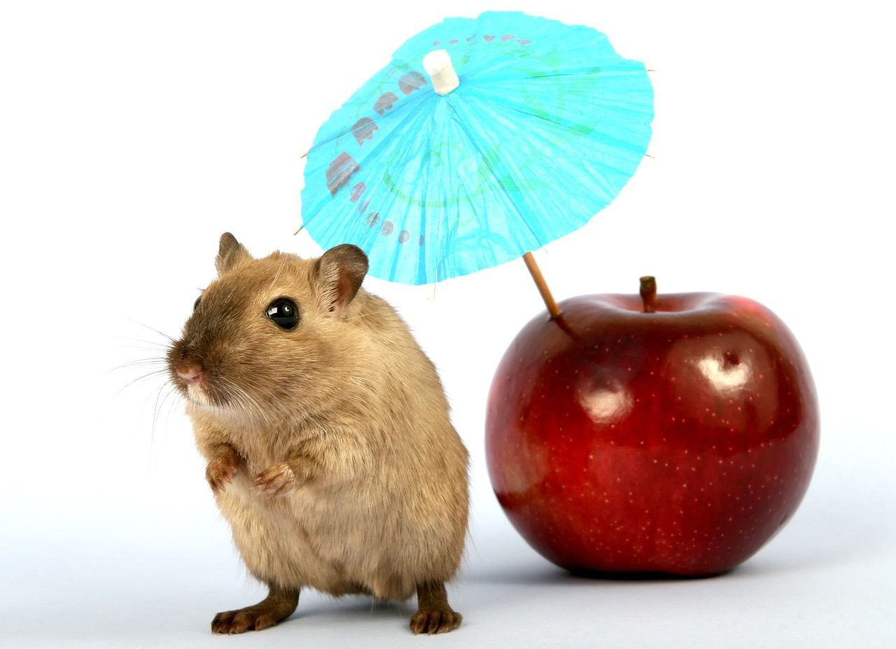
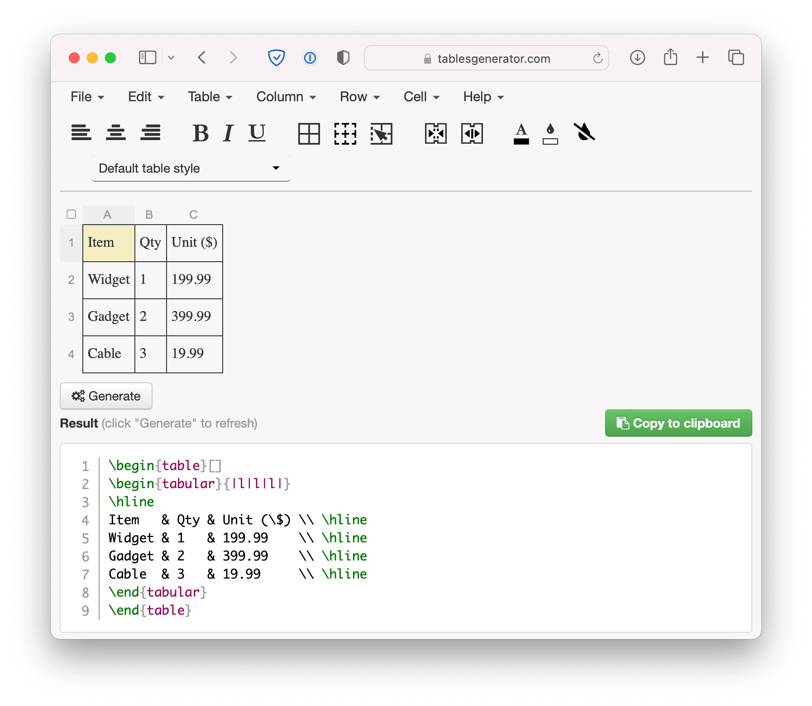
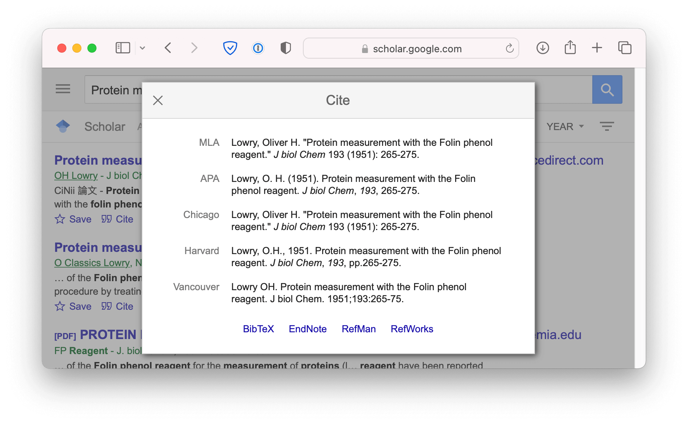
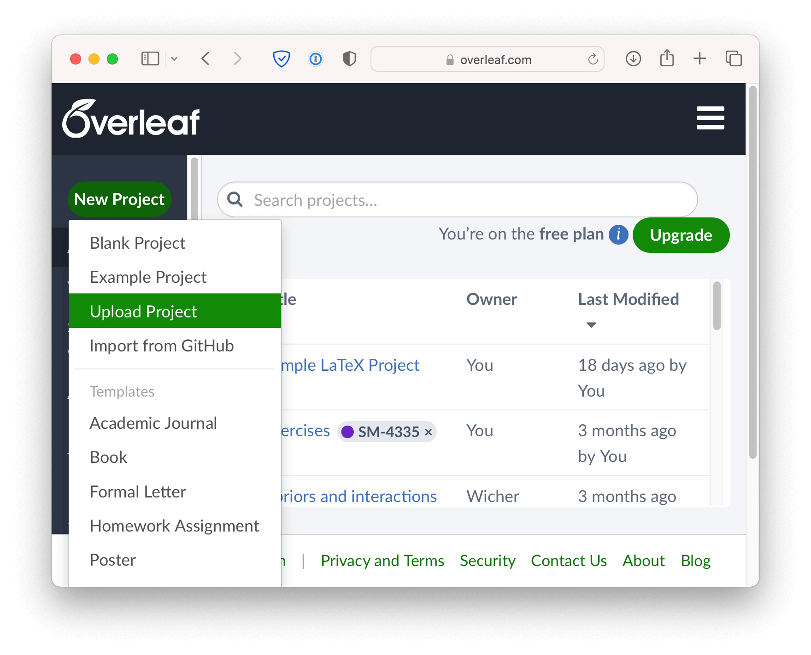

---
params:
  handout: 
title: "SM-2302 Software for Mathematicians"
subtitle: "\\LaTeX 2: Structured documents \\only<handout>{\\emph{[handout version]}}"
author: "Drs. Haziq Jamil & Huda Ramli"
date: "Semester I 2023/24"
institute: |
  | Mathematical Sciences, Faculty of Science, UBD
  | \url{https://github.com/sm2302-aug23}
output: 
  beamer_presentation:
    template: ubd_beamer_rmd.tex
    latex_engine: xelatex
    slide_level: 3
    keep_tex: true
    citation_package: biblatex
    pandoc_args: ["--lua-filter=luafilters/mycustom.lua", "--lua-filter=luafilters/bookdown.lua"] 
header-includes:
  # - \usepackage{polyglossia}  	
  # - \setdefaultlanguage{english}	
  # - \setotherlanguage{arabic} % to use arabic	
  # - \newfontfamily\arabicfontsf[Script=Arabic]{Amiri}	
  # - \usepackage{xeCJK}	
  # - \setCJKmainfont{SimSun}	
  # #- % Note that when arabic is set, the itemize becomes triangles
  # - \setbeamertemplate{itemize item}[circ]
  # - \setbeamertemplate{itemize subitem}[circ]
  # - \setbeamertemplate{itemize subsubitem}[circ]
  # - \usepackage{chemfig}
  # - \setchemfig{atom sep = 2em, bond join = true}
  # - \usepackage{chemmacros}
  # - \chemsetup{modules = {all}}
  # - \setbeamertemplate{caption}[numbered]
  - \usepackage{tikz}
  - \usetikzlibrary{shapes,arrows,positioning,shadows}
# include-after:
#   -
aspectratio: 169
handout: "`r params$handout`"
toc: false
toctitle: Overview
tocmulticol:
transitions: true
progressdots: false
# banner: true
# logo: true
bibliography: refs.bib
# bibstyle: 
refslide: false
thankyou: false
editor_options: 
  markdown: 
    wrap: 72
---

```{r setup, include = FALSE}
def.chunk.hook  <- knitr::knit_hooks$get("chunk")
knitr::knit_hooks$set(chunk = function(x, options) {
  x <- def.chunk.hook(x, options)
  ifelse(options$size != "normalsize", paste0("\n \\", options$size,"\n\n", x, "\n\n \\normalsize"), x)
})
# https://stackoverflow.com/questions/25646333/code-chunk-font-size-in-rmarkdown-with-knitr-and-latex

knitr::opts_chunk$set(
  echo = FALSE, 
  warning = FALSE,
  message = FALSE,
  error = TRUE,
  fig.height = 3.2, 
  fig.width = 7, 
  fig.path = "figure/", 
  fig.align = "center",
  out.width = "100%",
  cache = TRUE, 
  cache.path = "_cache/",
  size = "footnotesize"
)
options(width = 85)  # if 4:3 set to 55; if 16:9 set to 70
library(tidyverse)
theme_set(theme_classic())
library(tidyverse)
library(ggpubr)
library(cowplot)
library(ggrepel)
library(ggforce)
library(directlabels)

ubdblue <- "#325494"
ubdteal <- "#58DDB3"
ubdyellow <- "#F5C946"
ubdred <- "#B10F2E"
navyblue <- "#002f5c"
solidpink <- "#8E3B46"

mycol <- c("#30123BFF", "#4777EFFF", "#1BD0D5FF", "#62FC6BFF", "#D2E935FF",
           "#FE9B2DFF", "#DB3A07FF", "#7A0403FF")
```

### Introduction

- In Part 1, we learned about commands and environments for typesetting text and mathematics.

- Now, we'll learn about commands and environments for structuring documents.

- Firstly, we'll go through how to place floats, such as figures and tables, in \LaTeX documents.

\bigskip

Let's get started!

# Figures

- Requires the `graphicx` package, which provides the `\includegraphics`{.latex} command.

- Supported graphics formats include JPEG, PNG and PDF.


::: {.columns}

::: {.column width=68%}
\small
\vspace{-1em}
```latex
\includegraphics{gerbil}


\includegraphics[width=0.3\textwidth,
                 angle=270]{gerbil}
                 
                 
```
:::

::: {.column width=28%}
\includegraphics[width=\textwidth]{figure/gerbil}

\includegraphics[width=0.5\textwidth,angle=270]{figure/gerbil}
:::

:::

## Interlude: Optional arguments

- We use square brackets \framebox{\texttt{[}}  \framebox{\texttt{]}} for *optional* arguments, instead of braces  \framebox{\texttt{\{}}  \framebox{\texttt{\}}}.

- `\includegraphics`{.latex} accepts optional arguments that allow you to transform the image when it is included. For example, `width=0.3\textwidth`{.latex} makes the image take up 30% of the width of the surrounding text (`\textwidth`{.latex}).

- `\documentclass`{.latex} accepts optional arguments, too. E.g. `\documentclass[12pt,twocolumn]{article}`{.latex} makes the text bigger (12pt) and puts it into two columns.

### Floats 

- Allow \LaTeX\ to decide where the figure will go (it can "float").

- You can also give the figure a caption, which can be referenced with `\ref`{.latex}.

- For more on floats, visit [this link](https://www.overleaf.com/learn/latex/Positioning_images_and_tables).

::: {.columns}

::: {.column width=60%}
\small
\vspace{-1em}
```latex
\begin{figure}[htbp]
\centering 
\includegraphics[%
width=0.5\textwidth]{gerbil} 
\caption{\label{fig:gerbil}Aww\ldots.} 
\end{figure}

Figure \ref{fig:gerbil} shows a gerbil.
```
:::

::: {.column width=36%}
\vspace{-1em}
```{r gerbilcap, fig.cap = "Aww\\ldots"}

```

\vspace{-0.5em}
Figure \ref{fig:gerbilcap} shows a gerbil.
:::

:::

## Interlude: Tables

- Use the `tabular` environment wrapped in the `table` environment tht floats it. You can also `\caption` and `\label` to `\ref` it later.


::: {.columns}

::: {.column width=48%}
\footnotesize
\vspace{-1em}
```latex
\begin{table}[htbp]
\begin{tabular}{|l|l|l|}
\hline
Item   & Qty & Unit (\$) \\ \hline
Widget & 1   & 199.99    \\ \hline
Gadget & 2   & 399.99    \\ \hline
Cable  & 3   & 19.99     \\ \hline
\end{tabular}
\caption{My table}
\label{tab:mytab}
\end{table}
```
:::

::: {.column width=48%}

```{=latex}
\begin{table}[htbp]
\begin{tabular}{|l|c|r|}
\hline
Item   & Qty & Unit (\$) \\ \hline
Widget & 1   & 199.99    \\ \hline
Gadget & 2   & 399.99    \\ \hline
Cable  & 3   & 19.99     \\ \hline
\end{tabular}
\caption{My table}
\label{tab:mytab}
\end{table}
```

:::

:::

\vspace{0.5em}

- The argument specifies column alignment--**l**eft, **c**entre, **r**ight.

- `\hline`{.latex} and \framebox{\texttt{|}}  specifies horizontal and vertical lines resp.

- Use \framebox{\texttt{\&}} to separate columns and \framebox{\texttt{\textbackslash\textbackslash}} to start new line.

### Tablesgenerator.com

\centering
\vspace{-1em}

[](https://www.tablesgenerator.com)

### Exercise

:::: {.varblock latex="{Exercise 1 (Figures)}"}

Let's practice adding a picture using `\begin{figure}...\end{figure}`{.latex} and `\includegraphics`{.latex}. Download the following image by clicking on it.

```{=latex}
\href{https://github.com/haziqj/learn-latex/raw/main/figure/gerbil.jpg}{%
\begin{center}
\includegraphics[height=10cm]{figure/gerbil.jpg}
\end{center}
}
```

Click
\href{https://www.overleaf.com/docs?snip_uri=https://raw.github.com//haziqj/learn-latex/main/exercises/03-figures/03-figures.tex&splash=none}{\beamerbutton{Exercise 3}}
to open this exercise in **Overleaf**.

::::


# Structure

## Title, author, date

- Tell \LaTeX\ the `\title`{.latex} and `\author`{.latex} names in the preamble. Note that author names are separated by `\and`{.latex}.

- The `\date` command can be used to manually specify the date, or use `\date{\today}`{.latex} for today's date.

- Then use `\maketitle`{.latex} (inserted just after `\begin{document}`{.latex}) to actually create the title.


::: {.columns}

::: {.column width=53%}
\small
\vspace{-1em}
```latex
\documentclass{article}

\title{The Title}
\author{A. Author \and A. Nother}
\date{\today}

\begin{document} 
\maketitle
\end{document}
```
:::

::: {.column width=43%}

```{r maketitle}
knitr::include_graphics("figure/maketitle.pdf")
```
:::

:::

## Abstract

- Typically, a paper begins with the abstract.

- Use the `abstract` environment for this.

::: {.columns}

::: {.column width=53%}
\small
\vspace{-1em}
```latex
\documentclass{article}
\usepackage{lipsum}  % load this 
\title{The Title}
\author{A. Author \and A. Nother}
\date{\today}

\begin{document} 
\maketitle

\begin{abstract}
\lipsum[1]  % placeholder text
\end{abstract}

\end{document}
```
:::

::: {.column width=43%}

```{r abstract}
knitr::include_graphics("figure/abstract.pdf")
```
:::

:::

## Sections

- To section the document, use `\section`{.latex} and `\subsection`{.latex}.


::: {.columns}

::: {.column width=53%}
\small
\vspace{-1em}
```latex
\documentclass{article} 
\begin{document}

\section{Introduction}
The problem of \ldots 

\subsection{Sample Preparation} 

\subsection{Data Collection}

\section{Results}

\section{Conclusion}

\end{document}
```
:::

::: {.column width=43%}

```{r sections}
knitr::include_graphics("figure/sections.pdf")
```
:::

:::

### Cross-referencing

- As with equations, figures and tables, it is possible to cross-reference the sections. Just use `\label`{.latex} and `\ref`{.latex}.


::: {.columns}

::: {.column width=53%}
\footnotesize
\vspace{-1em}
```latex
\documentclass{article} 
\begin{document}

\section{Introduction}
Results are presented in section 
\ref{sec:results}.
In section \ref{sec:conc}, we conclude.

\section{Results}
\label{sec:results}

\section{Conclusion}
\label{sec:conc}

\end{document}
```
:::

::: {.column width=43%}

```{r crossref}
knitr::include_graphics("figure/crossref.pdf")
```

:::

:::


### Exercise

:::: {.varblock latex="{Exercise 2 (Structure)}"}

The document you will load contains all the text, but its structure is missing.
Go ahead and fix this:

- Add title, author and date.
- Add the abstract.
- Add sections.
- Cross reference the sections.

\vspace{1em}

Click
\href{https://www.overleaf.com/docs?snip_uri=https://raw.github.com//haziqj/learn-latex/main/exercises/04-article/04-article.tex&splash=none}{\beamerbutton{Exercise 4}}
to open this exercise in **Overleaf**.

::::


# Bibliography

## The bibtex format

- \LaTeX\ works off a 'bibtex' database format:

```latex
@article{lowry1951protein,
  title={Protein measurement with the Folin phenol reagent},
  author={Lowry, OH and Rosebrough, NJ and Farr, AL and 
          Randall, RJ},
  journal={Journal of Biological Chemistry},
  volume={193},
  pages={265--275},
  year={1951}
}
```

- Each bibtex entry has a *key* that you can use to reference it in the document. E.g., `lowry1951protein` is the key for the article above.

- It’s a good idea to use a key based on the name, year and title.


### A bib file

- Collect all your references into a bib file, say `refs.bib`. This file should be in the folder together with your tex file.

- Most reference managers (e.g. Mendeley or Zotero) can export to bibtex format.

- You can also use Google Scholar and do this manually.

```{r googlescholar, out.width = "65%"}

```

### Bib\LaTeX

- Use the `biblatex` package with the `natbib` option.

- The bibliography file must be called using  `\addbibresource`{.latex}.

- At the end, print the bibliography using `\printbibliography`{.latex}.


::: {.columns}

::: {.column width=53%}
\small
\vspace{-1em}
```latex
\documentclass{article} 
\usepackage[natbib]{biblatex} 
\addbibresource{refs.bib}
% if 'refs' is the name of 
% the bib file

\begin{document}
The most cited paper ever is 
\cite{lowry1951protein}.

\printbibliography
\end{document}
```
:::

::: {.column width=43%}

```{r biblatex1}
knitr::include_graphics("figure/biblatex1.pdf")
```

:::

:::

## Citation styles

- Use the optional argument `style` to change the citation style.


::: {.columns}

::: {.column width=53%}
\small
\vspace{-1em}
```latex
...

\usepackage[natbib,stype=apa]
  {biblatex} 

...
```
:::

::: {.column width=43%}

\vspace{-1em}

```{r biblatex2}
knitr::include_graphics("figure/biblatex2.pdf")
```

:::

:::

\vspace{0.5em}

- A number of citation styles exist:

   - `numeric`: (default) Numeric citation scheme
   - `apa`: American Psychological Association
   - `ieee`: Institute of Electrical and Electronics Engineers
   - `chicago`: Chicago style
   - `mla`: Modern Language Association

### Some `natbib` commands

- The `natbib` option allows several alternative citation commands, useful when using an author-year style such as the APA style.


::: {.columns}

::: {.column width=53%}
\small
\vspace{-1em}
```latex
% Textual citation
\citet{lowry1951protein}	

% Textual citation, all authors
\citet*{lowry1951protein}	

% Parenthetical citation
\citep{lowry1951protein}	

% Prints only the author name
\citeauthor{lowry1951protein}	

% Prints only the year 
\citeyear{lowry1951protein}	
```
:::

::: {.column width=43%}

```{r natbib}
knitr::include_graphics("figure/natbib.pdf")
```

:::

:::

### Exercise

\vspace{-1em}

:::: {.varblock latex="{Exercise 3 (Bibliography)}"}

We will add citations to the previous document.
To get started, download the zip file which contains all the files you need by clicking  \href{https://github.com/haziqj/learn-latex/raw/main/exercises/05-bibliography.zip}{\beamerbutton{Exercise 5}}.
**Do not unzip the zip file.**
Instead, upload it to Overleaf.

\vspace{-1em}

```{r upload, out.width = "42%"}

```

\vspace{-1.5em}
::::


# What's next?

### More neat things

- Add the `\tableofcontents`{.latex} command to generate a table of contents at the beginning of a document.

- Change the `\documentclass`{.latex} to `\documentclass{IEEEtran}`{.latex} or `\documentclass{apa7}`{.latex}.

- Define your own commands for complicated equations.

::: {.columns}

::: {.column width=48%}
\small
\vspace{-1.1em}
```latex
\newcommand{\rperf}{\rho_{\text{perf}}}
$$
\rperf = {\bf c}'{\bf X} + \varepsilon
$$
```
:::

::: {.column width=48%}
\newcommand{\rperf}{\rho_{\text{perf}}}
$$
\rperf = {\bf c}'{\bf X} + \varepsilon
$$
:::

:::

## More neat packages

- `beamer`: for presentations (like this one!)
- `todonotes`: comments and TODO management 
- `tikz`: make amazing graphics
- `pgfplots`: create graphs in \LaTeX
- `listings`: source code printer for \LaTeX
- `spreadtab`: create spreadsheets in \LaTeX
- `gchords`, guitar: guitar chords and tabulature 
- `cwpuzzle`: crossword puzzles

See https://www.overleaf.com/latex/examples and http://texample.net for examples of (most of) these packages.

## Installing \LaTeX

- To run \LaTeX{} on your own computer, you'll want to use a \LaTeX{}
\emph{distribution}. A distribution includes a `latex` program
and (typically) several thousand packages.

    - On Windows: \href{http://miktex.org/}{Mik\TeX} or \href{http://tug.org/texlive/}{\TeX Live}
    - On Linux: \href{http://tug.org/texlive/}{\TeX Live}
    - On Mac: \href{http://tug.org/mactex/}{Mac\TeX}

- You'll also want a text editor with \LaTeX{} support. See \url{http://en.wikipedia.org/wiki/Comparison_of_TeX_editors} for a list of (many) options.

- You'll also have to know more about how `latex` and its related tools
work--see the resources on the next slide.

## More resources

- [\underline{Overleaf}](https://www.overleaf.com/for/community/resources) is a great resource for learning \LaTeX: 

::: {.center latex=""}

[{ width=40% }](https://assets.ctfassets.net/nrgyaltdicpt/4e825etqMUW8vTF8drfRbw/d4f3d9adcb2980b80818f788e36316b2/A_quick_guide_to_LaTeX__Overleaf_version.pdf)

:::

- Others

  - \href{http://en.wikibooks.org/wiki/LaTeX}{The \LaTeX{} Wikibook}--excellent tutorials and reference material.
  
  - \href{http://tex.stackexchange.com/}{\TeX{} Stack Exchange}--ask
questions and get excellent answers incredibly quickly

   

- Unofficial UBD `beamer` theme: [link](https://github.com/haziqj/ubd-beamer)

- Need to convert to docx? Consider [pandoc](https://pandoc.org).
```bash
pandoc mydoc.tex -o mydoc.docx
```


